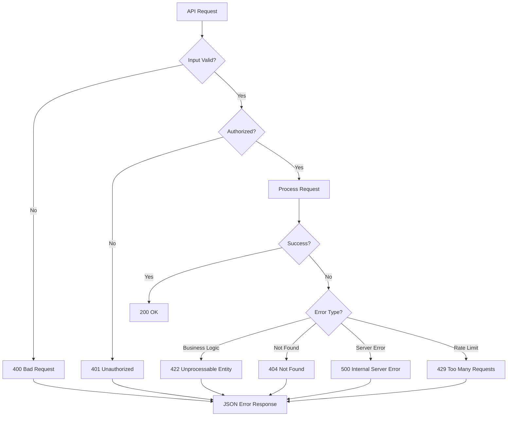

# API Dokumentation

## Überblick

Die API des Kohärenz Protokolls bietet RESTful Endpunkte für die Hauptfunktionen der Anwendung. Alle Endpunkte sind unter `/api` erreichbar und verwenden JSON für Anfragen und Antworten.

```mermaid
graph TD
    subgraph "API Endpoints"
        Root[/api]
        
        subgraph "Content Management"
            Ingest[POST /api/ingest]
            QATag[POST /api/qa-tag]
        end
        
        subgraph "Query & Search"
            Query[POST /api/query]
            Judge[POST /api/judge/context]
        end
        
        subgraph "Persona Management"
            PersonaCreate[POST /api/persona]
            PersonaList[GET /api/persona]
            PersonaUpdate[PUT /api/persona/:id]
            PersonaDelete[DELETE /api/persona/:id]
        end
        
        Root --> Ingest
        Root --> QATag
        Root --> Query
        Root --> Judge
        Root --> PersonaCreate
        Root --> PersonaList
        Root --> PersonaUpdate
        Root --> PersonaDelete
    end
    
    subgraph "Request Flow"
        Client[Client Application]
        Validation[Input Validation]
        Processing[Business Logic]
        Storage[Data Storage]
        Response[JSON Response]
        
        Client --> Validation
        Validation --> Processing
        Processing --> Storage
        Storage --> Response
        Response --> Client
    end
```

## Authentifizierung

Für die Entwicklung ist keine Authentifizierung erforderlich. In Produktionsumgebungen sollte ein Authentifizierungsmechanismus implementiert werden.

## Endpunkte

### POST /api/ingest

Ingestion von Inhalten in das System.

**Anfrage:**
```json
{
  "content": "string",
  "metadata": {
    "source": "string",
    "chapter": "string",
    "beat": "string"
  }
}
```

**Antwort:**
```json
{
  "message": "Content ingested successfully",
  "contentLength": 1234,
  "metadata": {}
}
```

### POST /api/qa-tag

Generierung von QA-Paaren und Tags aus Inhalten.

**Anfrage:**
```json
{
  "content": "string",
  "spanId": "string"
}
```

**Antwort:**
```json
{
  "message": "QA tagging completed successfully",
  "spanId": "string",
  "questionsGenerated": 5,
  "answersGenerated": 15
}
```

### POST /api/query

Fragebasierte Abfrage mit semantischer Suche.

**Anfrage:**
```json
{
  "question": "string",
  "personaId": "string (optional)"
}
```

**Antwort:**
```json
{
  "message": "Query processed successfully",
  "question": "string",
  "answers": [
    {
      "id": "string",
      "content": "string",
      "type": "short|mid|long",
      "citations": ["spanId1", "spanId2"]
    }
  ],
  "citations": [
    {
      "id": "string",
      "content": "string"
    }
  ]
}
```

### POST /api/judge/context

LLM-as-judge für Kontextbewertung und NBA-Generierung.

**Anfrage:**
```json
{
  "context": "string",
  "criteria": "string (optional)"
}
```

**Antwort:**
```json
{
  "message": "Judgement completed successfully",
  "contextLength": 1234,
  "nbas": [
    {
      "id": "string",
      "label": "string",
      "action": "string",
      "description": "string"
    }
  ]
}
```

### POST /api/persona (CRUD)

Verwaltung von Personas.

**POST /api/persona - Persona erstellen**

**Anfrage:**
```json
{
  "name": "string",
  "description": "string"
}
```

**Antwort:**
```json
{
  "message": "Persona created successfully",
  "persona": {
    "id": "string",
    "name": "string",
    "description": "string",
    "thoughtsNamespace": "string"
  }
}
```

**GET /api/persona - Personas abrufen**

**Antwort:**
```json
{
  "message": "Personas fetched successfully",
  "personas": [
    {
      "id": "string",
      "name": "string",
      "description": "string",
      "thoughtsNamespace": "string"
    }
  ]
}
```

## Fehlerbehandlung



Alle API-Endpunkte folgen einem konsistenten Fehlerformat:

```json
{
  "error": "Beschreibung des Fehlers",
  "code": "ERROR_CODE",
  "details": {
    "field": "specific error details"
  },
  "timestamp": "2024-01-01T00:00:00Z"
}
```

## Rate Limiting

In Produktionsumgebungen sollte Rate Limiting implementiert werden.

## Versionierung

Die API folgt der Versionierung im Repository. Breaking Changes werden in separaten Major-Versionen veröffentlicht.
