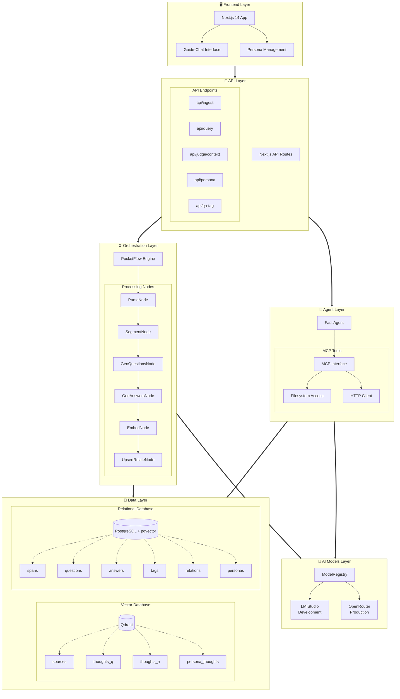
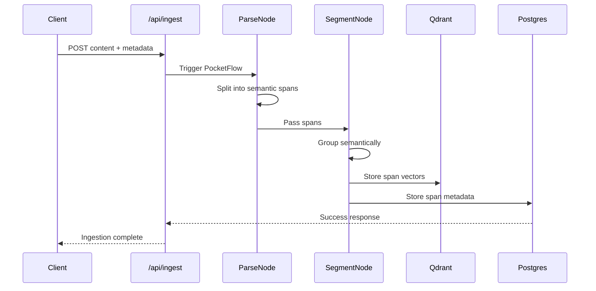
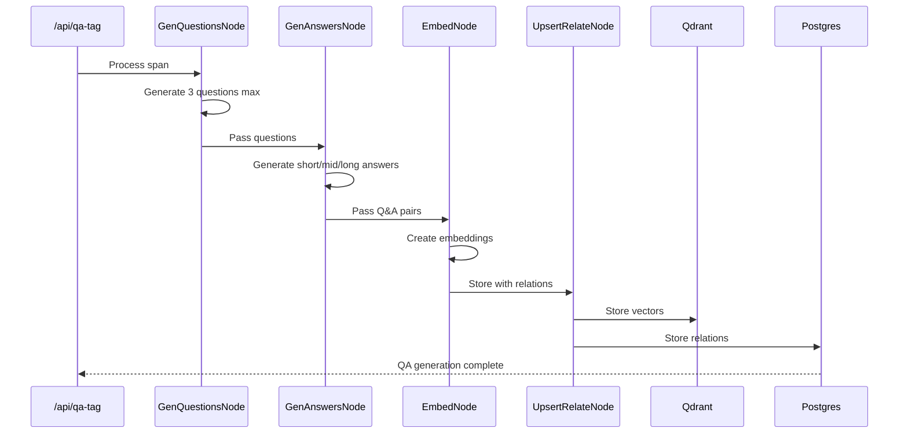
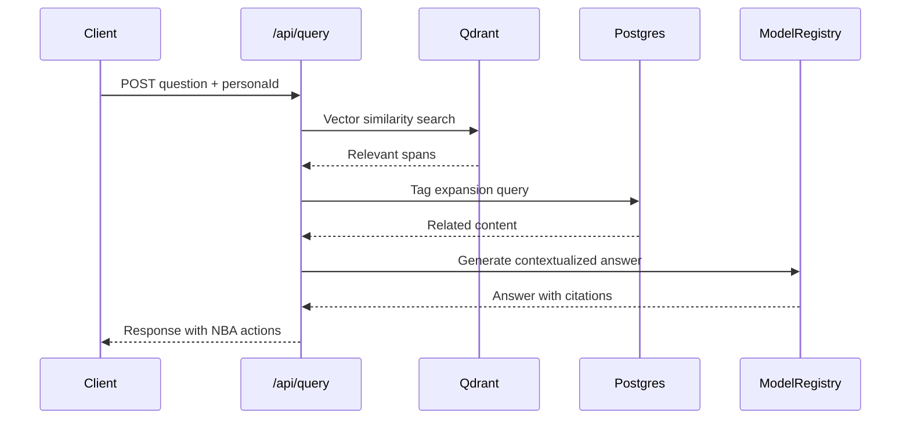
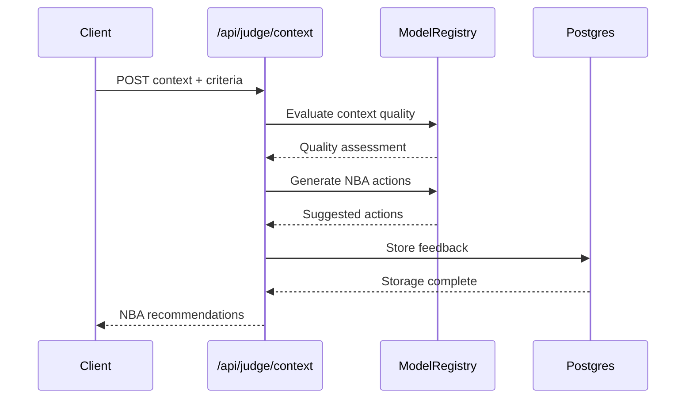
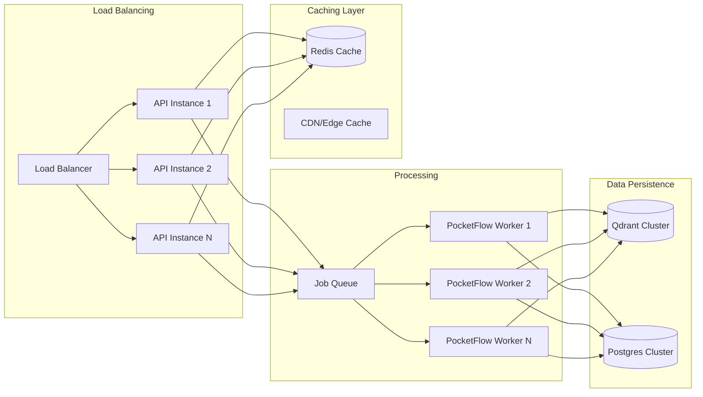

# Architektur des Kohärenz Protokolls

## Überblick

Das Kohärenz Protokoll ist eine mehrschichtige Anwendung zur Verarbeitung und Abfrage strukturierter Inhalte mit KI-unterstützter Analyse. Die Architektur folgt einer modularen, skalierbaren Herangehensweise mit klaren Trennungen zwischen den Schichten.

## Systemkomponenten

### 1. Frontend (apps/web)

- **Framework**: Next.js 14 mit App Router
- **KI-Integration**: ai-sdk v5 für Streaming und Echtzeit-Interaktion
- **UI-Komponenten**: shadcn/ui für konsistente Benutzeroberfläche
- **Hauptfunktionen**:
  - Guide-Chat Interface mit NBA-Actions
  - Visualisierung von Abfrageergebnissen
  - Persona Management

### 2. API Layer (apps/web/src/app/api)

- **Technologie**: Next.js API Routes (Node/Edge)
- **Endpunkte**:
  - `/api/ingest` - Content Ingestion
  - `/api/qa-tag` - QA-Generierung und Tagging
  - `/api/query` - Semantische Abfrage
  - `/api/judge/context` - Kontextbewertung
  - `/api/persona` - Persona Management
- **Background Jobs**: für rechenintensive Tasks

### 3. Orchestrierung (packages/flows)

- **Framework**: PocketFlow für Workflow-Orchestrierung
- **Nodes**:
  - Parse: Text in Spans zerlegen
  - Segment: Semantisches Clustering
  - GenQuestions: Generierung atomarer Fragen
  - GenAnswers: Erstellung kurzer/mittlerer/langer Antworten
  - Embed: Vektoreinbettung generieren
  - Upsert/Relate: Speichern in Datenbanken
- **Eigenschaften**: Kurze, idempotente Steps

### 4. Agentik (packages/agents)

- **Framework**: Fast Agent mit MCP-Tools
- **Fähigkeiten**:
  - Dateisystemzugriff
  - HTTP-Anfragen
  - Spezialisierte Tasks
- **Integration**: Mit PocketFlow Workflows

### 5. Datenzugriff (packages/core)

- **Vektor Store**: Qdrant für semantische Suche
  - Collections: sources, thoughts_q, thoughts_a, persona_thoughts
- **Relationale Datenbank**: Postgres mit pgvector
  - Tags, Fragen, Antworten, Relationen
  - Personas und deren Gedanken
  - Bewertungen und Jobs
- **SDK**: Einheitliche Schnittstelle für beide Speichertypen

### 6. KI-Modelle (packages/core)

- **Provider-Adapter**:
  - LM Studio (lokale Entwicklung)
  - OpenRouter (Produktion/Fallback)
- **ModelRegistry**: Zentrale Konfiguration und Auswahl
- **Funktionen**: Textgenerierung, Embedding

## Datenfluss

### Content Ingestion Flow

### QA Generation Flow

### Semantic Query Flow

### Context Evaluation Flow

## Qualitätssicherung

- **Zitationen**: Jede Mid-Antwort hat ≥1 Zitat
- **Fragebegrenzung**: Max 3 Fragen pro Span
- **Deduplikation**: Clustering zur Vermeidung von Duplikaten
- **Spoiler-Gate**: Kapitel-/Beat-Beschränkung vor Retrieval

## Skalierbarkeit

### Skalierungsstrategien:
- **Horizontale Skalierung**: Durch stateless API-Routes und Agents
- **Batch-Processing**: Für große Mengen an Inhalten
- **Caching**: Für häufige Abfragen
- **Background Jobs**: Für asynchrone Verarbeitung
- **Database Sharding**: Für große Datenmengen
- **Vector Index Optimization**: Für schnelle Suche
