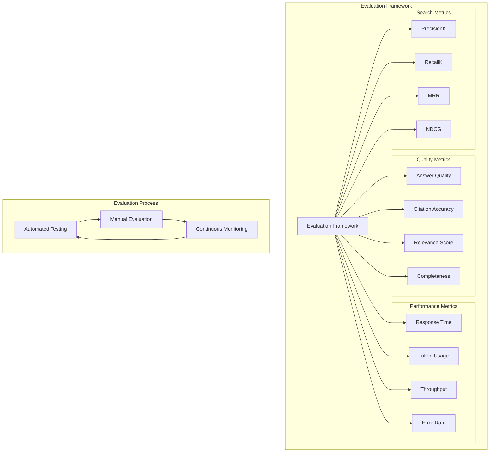
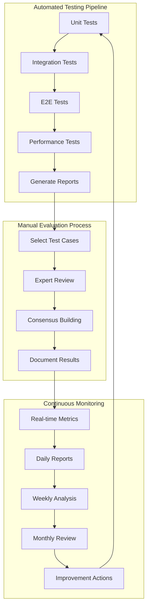
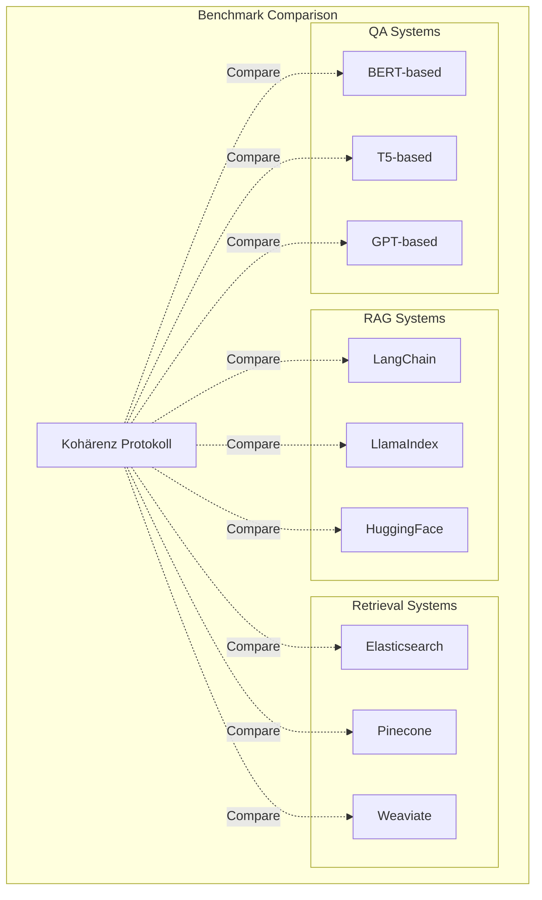

# Evaluierung des Kohärenz Protokolls

## Überblick

Diese Dokumentation beschreibt die Evaluierungsmethoden für das Kohärenz Protokoll, einschließlich der Metriken, Testverfahren und Bewertungskriterien.



## Evaluierungskategorien

### 1. Qualität der Antworten

#### Metriken:
- **Zitationsrate**: Anteil der Antworten mit korrekten Zitaten
- **Relevanz**: Grad der Relevanz zur gestellten Frage (1-5)
- **Genauigkeit**: Faktische Korrektheit der Antworten (1-5)
- **Vollständigkeit**: Abdeckung aller relevanten Aspekte (1-5)

#### Bewertungsmethoden:
- Manuelle Bewertung durch Experten
- Vergleich mit Referenzantworten
- Crowd-Sourcing für subjektive Metriken

### 2. Semantische Suche

#### Metriken:
- **Precision@K**: Anteil relevanter Ergebnisse unter den ersten K Treffern
- **Recall@K**: Anteil aller relevanten Ergebnisse unter den ersten K Treffern
- **MRR (Mean Reciprocal Rank)**: Mittlerer reziproker Rang des ersten relevanten Treffers
- **NDCG (Normalized Discounted Cumulative Gain)**: Bewertung der Rangfolge

#### Bewertungsmethoden:
- Gold-Standard-Datensätze
- Nutzerstudien zur Suchrelevanz
- A/B-Tests mit unterschiedlichen Modellen

### 3. Systemleistung

#### Metriken:
- **Antwortzeit**: Zeit von Anfrage bis vollständiger Antwort
- **Token-Nutzung**: Durchschnittliche Anzahl verwendeter Tokens pro Antwort
- **Durchsatz**: Anfragen pro Sekunde
- **Fehlerquote**: Anteil fehlgeschlagener Anfragen

#### Bewertungsmethoden:
- Lasttests mit simulierten Anfragen
- Monitoring in Produktionsumgebung
- Benchmarking gegen Referenzsysteme

## Testdaten

### 1. Synthetische Testdaten

#### Ingestion-Tests:
- Kurze Texte (100-500 Wörter)
- Mittlere Texte (500-2000 Wörter)
- Lange Texte (2000+ Wörter)
- Verschiedene Inhaltsarten (technisch, narrativ, analytisch)

#### QA-Generierungs-Tests:
- Verschiedene Domänen (Wissenschaft, Fiktion, Dokumentation)
- Komplexitätsstufen (einfach, mittel, schwer)
- Fragetypen (faktisch, analytisch, hypothetisch)

### 2. Reale Testdaten

#### Literatur-Korpus:
- Exemplarische Kapitel aus dem Kohärenz Protokoll
- Verschiedene Autorenstile
- Unterschiedliche Narrative Strukturen

#### Benutzeranfragen:
- Historische Anfragen aus vergleichbaren Systemen
- Künstlich generierte repräsentative Anfragen
- Expertenbasierte Fragestellungen

## Evaluierungsprozess



### 1. Automatisierte Tests

#### Unit-Tests für Core-Package:
```bash
# Ausführung der Tests
pnpm --filter @kohaerenz/core test

# Testabdeckung
pnpm --filter @kohaerenz/core test --coverage
```

#### API E2E-Tests:
```bash
# Ausführung der End-to-End-Tests
pnpm test:e2e
```

#### Evaluierungsskripte:
```python
# Beispiel: Evaluierung der Antwortqualität
python eval/answer_quality.py --dataset testdata/qa_pairs.json --model gpt-4
```

### 2. Manuelle Evaluierung

#### Bewertungsraster:
| Metrik | 1 (schlecht) | 2 | 3 (mittel) | 4 | 5 (gut) |
|--------|--------------|---|------------|---|---------|
| Relevanz | Vollkommen irrelevant | ... | ... | ... | Vollständig relevant |
| Genauigkeit | Vollständig falsch | ... | ... | ... | Vollständig korrekt |
| Vollständigkeit | Keine relevanten Aspekte | ... | ... | ... | Alle Aspekte abgedeckt |

#### Evaluierungsdurchführung:
1. Auswahl repräsentativer Testfälle
2. Unabhängige Bewertung durch mehrere Experten
3. Konsensfindung bei abweichenden Bewertungen
4. Dokumentation der Ergebnisse

### 3. Kontinuierliche Evaluierung

#### Monitoring:
- Tägliche Metrikberichte
- Wöchentliche Deep-Dive-Analysen
- Monatliche Systemevaluierung

#### Feedback-Schleifen:
- Benutzerfeedback sammeln
- Fehleranalyse durchführen
- Verbesserungsvorschläge ableiten

## Benchmarking



### 1. Baseline-Systeme

#### Vergleich mit:
- RAG-Systeme (LangChain, LlamaIndex)
- Retrieval-Systeme (Elasticsearch, Pinecone)
- Fragebeantwortungssysteme (BERT-basiert)

### 2. Benchmark-Datensätze

#### SQuAD (Stanford Question Answering Dataset):
- Evaluierung der Faktenabfrage
- Vergleich mit state-of-the-art Systemen

#### MS MARCO (Microsoft Machine Reading Comprehension):
- Evaluierung der Passage-Ranking-Fähigkeit
- Relevanzbewertung für komplexe Anfragen

#### Natural Questions:
- Evaluierung mit natürlichen, suchmaschinenbasierten Fragen
- Vergleich mit kommerziellen Fragebeantwortungssystemen

## Verbesserungsmaßnahmen

### 1. Identifizierte Probleme

#### Häufige Fehlerkategorien:
- Unzureichende Kontextverarbeitung
- Übermäßige Halluzinationen
- Schlechte Zitationspraxis
- Mangelnde Kohärenz in langen Antworten

### 2. Optimierungsstrategien

#### Prompt Engineering:
- Iterative Verbesserung der Prompt-Muster
- Spezifische Anweisungen für Edge Cases
- Kontextfensteroptimierung

#### Modellfeinabstimmung:
- Domain-spezifisches Fine-Tuning
- Adapter-basierte Anpassung
- Few-Shot-Learning-Optimierung

#### Systemarchitektur:
- Caching-Strategien verbessern
- Parallelverarbeitung optimieren
- Fehlerbehandlung verfeinern

## Berichterstattung

### 1. Regelmäßige Berichte

#### Tägliche Zusammenfassung:
- Systemverfügbarkeit
- Durchschnittliche Antwortzeiten
- Fehlerquoten

#### Wöchentliche Analyse:
- Detaillierte Metrikbewertungen
- Trendanalysen
- Vergleich mit vorheriger Woche

#### Monatliche Evaluierung:
- Vollständige Systembewertung
- Benchmark-Ergebnisse
- Verbesserungsempfehlungen

### 2. Dashboards

#### Metrik-Dashboard:
- Echtzeit-Ansicht wichtiger Kennzahlen
- Historische Entwicklung
- Alerting bei Abweichungen

#### Qualitäts-Dashboard:
- Antwortqualität nach Kategorien
- Benutzerfeedback
- Fehleranalysen
