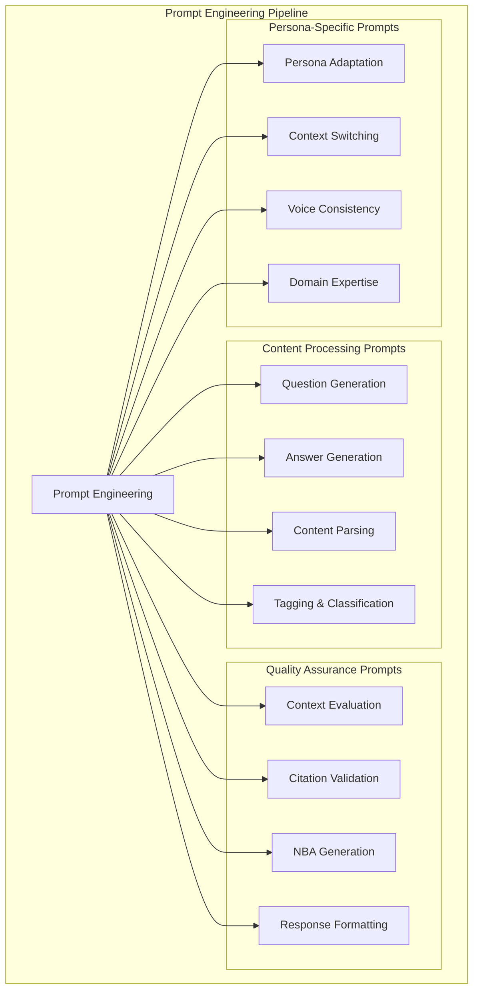
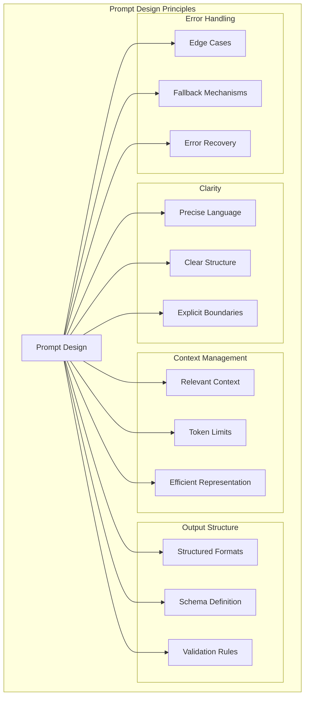

# Prompt Engineering für das Kohärenz Protokoll

## Überblick

Das Kohärenz Protokoll verwendet verschiedene Prompts für die KI-gestützte Verarbeitung von Inhalten. Diese Dokumentation beschreibt die verwendeten Prompt-Muster und Best Practices.



## Prompt-Kategorien

### 1. Fragegenerierung (GenQuestionsNode)

**Zweck**: Generierung atomarer Fragen aus Textspans

**Prompt-Muster**:
```
Generiere 3 atomare Fragen aus dem folgenden Textabschnitt:

[TEXT]

Anforderungen:
1. Jede Frage muss präzise und spezifisch sein
2. Jede Frage muss allein mit Informationen aus dem Textabschnitt beantwortbar sein
3. Keine Meta-Fragen (Fragen über den Text)
4. Formuliere in natürlicher Sprache

Gib die Fragen als JSON-Array zurück:
{
  "questions": [
    "Frage 1",
    "Frage 2", 
    "Frage 3"
  ]
}
```

### 2. Antwortgenerierung (GenAnswersNode)

**Zweck**: Generierung von Antworten unterschiedlicher Länge

**Prompt-Muster für kurze Antworten**:
```
Beantworte die folgende Frage kurz und präzise basierend auf dem Kontext:

Frage: [QUESTION]
Kontext: [CONTEXT]

Anforderungen:
- Maximale Länge: 1 Satz
- Fokus auf die wesentliche Information
- Verwende Quellenangaben im Format [1], [2], etc.
```

**Prompt-Muster für mittlere Antworten**:
```
Beantworte die folgende Frage ausführlich basierend auf dem Kontext:

Frage: [QUESTION]
Kontext: [CONTEXT]

Anforderungen:
- Länge: 2-3 Sätze
- Strukturierte Antwort mit klaren Aussagen
- Verwende Quellenangaben im Format [1], [2], etc.
- Jede Aussage muss im Kontext begründet sein
```

**Prompt-Muster für lange Antworten**:
```
Erstelle eine detaillierte Antwort auf die folgende Frage basierend auf dem Kontext:

Frage: [QUESTION]
Kontext: [CONTEXT]

Anforderungen:
- Länge: 5-8 Sätze
- Strukturierte Antwort mit Einleitung, Hauptteil und Zusammenfassung
- Verwende Quellenangaben im Format [1], [2], etc.
- Vertiefe relevante Aspekte mit Erklärungen
```

### 3. Tagging und Kategorisierung

**Zweck**: Semantische Kategorisierung von Inhalten

**Prompt-Muster**:
```
Weise dem folgenden Text semantische Tags zu:

[TEXT]

Anforderungen:
1. Wähle 3-5 relevante Tags
2. Jeder Tag soll ein einzelnes Wort oder eine kurze Phrase sein
3. Tags sollen semantisch bedeutungsvoll sein
4. Vermeide allgemeine oder vage Tags

Gib die Tags als JSON-Array zurück:
{
  "tags": [
    "Tag 1",
    "Tag 2",
    "Tag 3"
  ]
}
```

### 4. Kontextbewertung (Judge)

**Zweck**: Bewertung von Kontexten durch LLM-as-judge

**Prompt-Muster**:
```
Bewerte den folgenden Kontext anhand der angegebenen Kriterien:

Kontext: [CONTEXT]

Kriterien:
1. Kohärenz: Logische Zusammenhänge und Struktur
2. Relevanz: Bezug zur ursprünglichen Frage
3. Vollständigkeit: Abdeckung aller Aspekte
4. Genauigkeit: Korrektheit der Informationen

Anforderungen:
1. Bewerte jedes Kriterium auf einer Skala von 1-5
2. Begründe jede Bewertung kurz
3. Schlage Verbesserungen vor

Gib das Ergebnis als strukturiertes JSON zurück.
```

## Best Practices



### 1. Klare Anweisungen

- Verwende präzise, unmissverständliche Sprache
- Definiere explizit die erwartete Ausgabestruktur
- Setze klare Begrenzungen (Länge, Format, etc.)

### 2. Kontextmanagement

- Stelle sicher, dass der relevante Kontext enthalten ist
- Vermeide Kontextfensterüberschreitung
- Verwende effiziente Kontextrepräsentation

### 3. Strukturierte Ausgaben

- Fordere strukturierte Ausgaben (JSON, YAML) an
- Definiere das Schema explizit
- Implementiere Validierung in den Nodes

### 4. Fehlerbehandlung

- Berücksichtige mögliche Fehlerquellen in den Prompts
- Füge Anweisungen für Edge Cases hinzu
- Plane Fallback-Mechanismen ein

## Prompt-Versionierung

Prompts werden versioniert, um Änderungen nachvollziehen zu können:

```
[KOMPONENTE]_v[VERSION]_[VARIANT]
```

Beispiel: `GenQuestions_v1_atomic`

## Testing

Für jedes Prompt-Muster sollten Testfälle definiert werden:

1. **Positive Tests**: Erwartete Eingaben
2. **Negative Tests**: Fehlerhafte Eingaben
3. **Edge Cases**: Grenzwertige Szenarien
4. **Performance Tests**: Antwortzeiten und Token-Nutzung

## Iteration

Prompt-Engineering folgt einem iterativen Prozess:

1. Definition des Prompt-Musters
2. Test mit Beispieldaten
3. Bewertung der Ergebnisse
4. Anpassung basierend auf Feedback
5. Dokumentation der Änderungen
