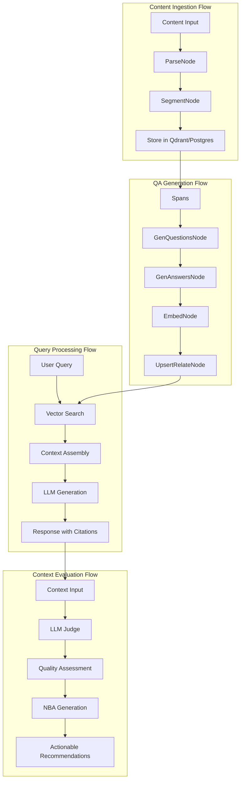
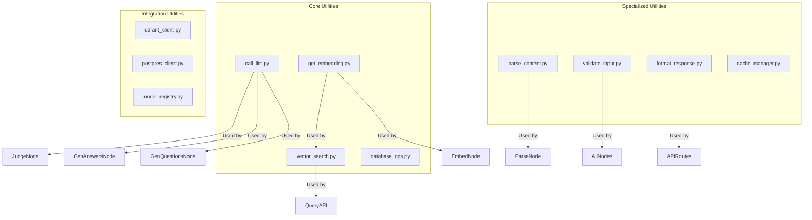
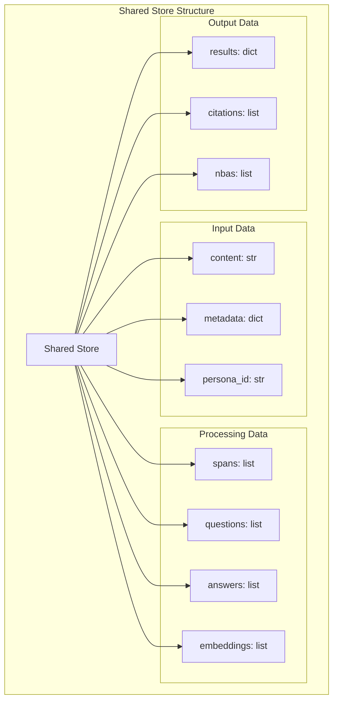
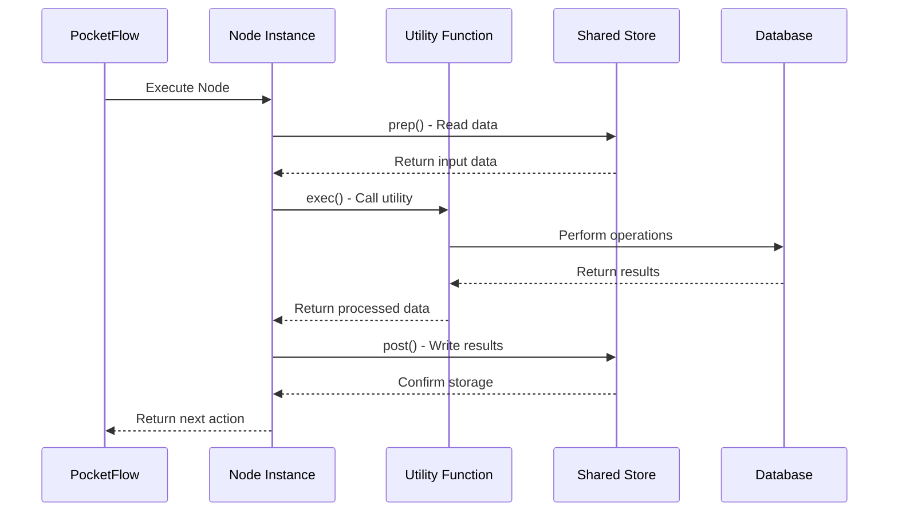

# Kohärenz Protokoll - System Design

## Requirements

Das Kohärenz Protokoll ermöglicht strukturierte Wissensverarbeitung und -abfrage mit KI-gestützter Analyse:

**User Stories:**
- Als Autor möchte ich Inhalte einpflegen und automatisch QA-Paare generieren lassen
- Als Benutzer möchte ich natürlichsprachige Fragen stellen und kontextualisierte Antworten erhalten
- Als Forscher möchte ich verschiedene Personas verwenden, um unterschiedliche Perspektiven zu erkunden
- Als Analyst möchte ich die Qualität von Kontexten bewerten und Verbesserungsvorschläge erhalten

## Flow Design

### Applicable Design Patterns:

1. **RAG (Retrieval-Augmented Generation)**: Semantische Suche + LLM-Generierung
2. **Map-Reduce**: Content in Spans aufteilen, parallel verarbeiten, Ergebnisse zusammenführen
3. **Agent Pattern**: LLM-basierte Entscheidungsfindung für NBA-Actions
4. **Workflow Orchestration**: PocketFlow für komplexe, mehrstufige Verarbeitung

### System Flow Design:


## Utility Functions



### Key Utility Functions:

1. **Call LLM** (`utils/call_llm.py`)
   - *Input*: prompt (str), model (str), temperature (float)
   - *Output*: response (str)
   - Used by GenQuestionsNode, GenAnswersNode, JudgeNode

2. **Get Embedding** (`utils/get_embedding.py`)
   - *Input*: text (str)
   - *Output*: vector of 1536 floats (OpenAI ada-002)
   - Used by EmbedNode and vector search operations

3. **Vector Search** (`utils/vector_search.py`)
   - *Input*: query_vector (list), collection (str), limit (int)
   - *Output*: list of search results with scores
   - Used by query processing and semantic search

4. **Database Operations** (`utils/database_ops.py`)
   - *Input*: varies by operation
   - *Output*: database results
   - Used by all nodes that interact with Postgres

5. **Parse Content** (`utils/parse_content.py`)
   - *Input*: raw content (str), metadata (dict)
   - *Output*: list of semantic spans
   - Used by ParseNode for content segmentation

## Node Design

### Shared Store

> Notes for AI: Try to minimize data redundancy

The shared store structure is organized as follows:

```python
shared = {
    "key": "value"
}
```

### Node Steps

> Notes for AI: Carefully decide whether to use Batch/Async Node/Flow.

1. First Node
  - *Purpose*: Provide a short explanation of the node’s function
  - *Type*: Decide between Regular, Batch, or Async
  - *Steps*:
    - *prep*: Read "key" from the shared store
    - *exec*: Call the utility function
    - *post*: Write "key" to the shared store

2. Second Node
  ...


### Shared Store Architecture



The shared store structure minimizes data redundancy:

```python
shared = {
    # Input
    "content": "raw text content",
    "metadata": {"source": "file.txt", "chapter": "1"},
    "persona_id": "optional_persona_uuid",
    
    # Processing
    "spans": [{"id": "span_1", "content": "...", "metadata": {...}}],
    "questions": [{"span_id": "span_1", "question": "...", "type": "factual"}],
    "answers": [{"question_id": "q_1", "short": "...", "mid": "...", "long": "..."}],
    "embeddings": [{"id": "emb_1", "vector": [...], "type": "question|answer"}],
    
    # Output
    "results": {"processed_spans": 5, "generated_questions": 15},
    "citations": [{"id": "cite_1", "content": "...", "source": "..."}],
    "nbas": [{"id": "nba_1", "label": "...", "action": "...", "description": "..."}]
}
```

### Node Implementation Patterns



### Key Node Implementations:

1. **ParseNode** (Regular Node)
   - *Purpose*: Split content into semantic spans
   - *Type*: Regular Node
   - *Steps*:
     - *prep*: Read "content" and "metadata" from shared store
     - *exec*: Call parse_content() utility function
     - *post*: Write "spans" to shared store

2. **GenQuestionsNode** (Batch Node)
   - *Purpose*: Generate atomic questions from spans
   - *Type*: Batch Node (processes multiple spans)
   - *Steps*:
     - *prep*: Read "spans" from shared store
     - *exec*: Call call_llm() for each span with question generation prompt
     - *post*: Write "questions" to shared store

3. **GenAnswersNode** (Batch Node)
   - *Purpose*: Generate short/mid/long answers for questions
   - *Type*: Batch Node (processes multiple questions)
   - *Steps*:
     - *prep*: Read "questions" and related "spans" from shared store
     - *exec*: Call call_llm() for each question with answer generation prompts
     - *post*: Write "answers" to shared store

4. **EmbedNode** (Async Batch Node)
   - *Purpose*: Generate embeddings for questions and answers
   - *Type*: Async Batch Node (I/O bound operations)
   - *Steps*:
     - *prep*: Read "questions" and "answers" from shared store
     - *exec*: Call get_embedding() for each text asynchronously
     - *post*: Write "embeddings" to shared store

5. **UpsertRelateNode** (Regular Node)
   - *Purpose*: Store data in Qdrant and Postgres with relationships
   - *Type*: Regular Node
   - *Steps*:
     - *prep*: Read all processed data from shared store
     - *exec*: Call database_ops() to store in both databases
     - *post*: Write "results" summary to shared store